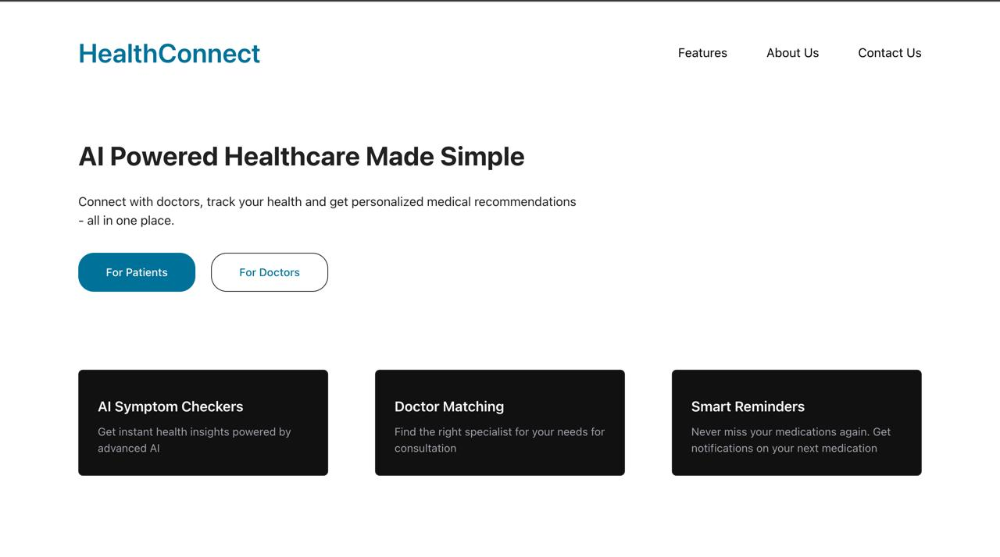
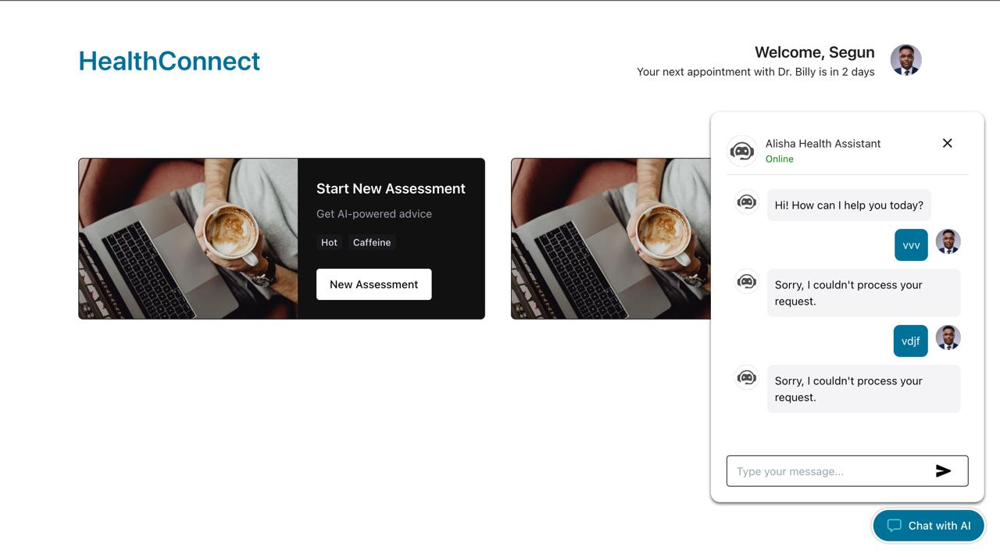
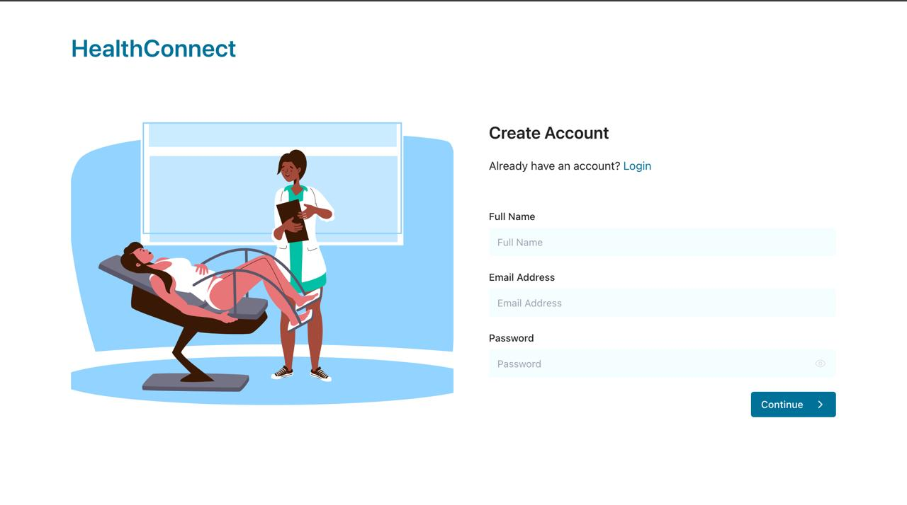

# STEINACK HEALTH CONNECT 




## Table of Contents

- [About the Project](#about-the-project)
- [Features](#features)
- [Technologies Used](#technologies-used)
- [Installation](#installation)
- [Usage](#usage)
- [Screenshots](#screenshots)
- [Contributors](#contributors)
- [License](#license)


## ABOUT THE PROJECT

Our innovative project aims to transform the healthcare landscape by tackling the age-old challenge of accessibility. We're developing an **AI-powered chatbot** that connects patients with experienced specialists, ensuring timely and personalized care.

---

### Key Objectives:
- Improve Access to Quality Healthcare: Increase availability and affordability of healthcare services.

- Enhance Patient Engagement: Empower patients to take an active role in their healthcare through education, communication, and participation.

- Enhance collaborative development skills in a team setting.

---

## Features

- **AI-Powered Chatbots:** Intelligent chatbots that help patients connect with doctors, answer medical queries, and provide personalized health advice.

- **Virtual Consultations:** Secure and convenient video consultations that enable patients to consult with doctors remotely, reducing wait times and improving access to care.

- **Personalized Health Records:** Secure and centralized electronic health records that store patients' medical history, test results, and treatment plans, enabling better care coordination and management.

- **Specialist Networking:** A network of specialized doctors and healthcare professionals that patients can access for expert advice, second opinions, and referrals, ensuring they receive the best possible care.

---
## TECHNOLOGIES USED 

- **React**: For building reusable components and managing application state.
- **JavaScript (ES6+)**: Core language for dynamic functionality.
- **API Integration**: For dynamic and real-time content updates.
- **Tail-Wind css**: Styling and layout design.
- **Open AI (LLM)**
- **Python**
- **Django**

---

## Installation

1. Clone the repository:

   ```bash
   git clone https://github.com/Cavista-Hackathon-2025/health-connect.git
   ```

2. Navigate to the project directory:

   ```bash
   cd health-connect
   ```

3. Install dependencies:

   ```bash
   npm install
   ```

4. Start the development server:

   ```bash
   npm start
   ```

---

## Usage

- Navigate to the application in your web browser (usually [http://localhost:3000](http://localhost:3000)).
- Explore the web app and get your valid health problem solved.

---

## Screenshots

 
 


---

## CONTRIBUTORS

This project was developed collaboratively by a team of contributors specializing in various aspects of frontend development.


**Owolabi Akintan**  
- GitHub: [Owolabi Akintan](https://github.com/owolabi-develop)  
- Email: awolabidevelop@gmail.com.com

**Felix Divine**  
- GitHub: [ExpectationsHACK](https://github.com/ExpectationsHACK)  
- Email: chestervonwest@gmail.com

**Jeremiah Adekitan**  
- GitHub: [Jeremiah Adekitan](https://github.com/jadekitan)  
- Email: jadekitan23@gmail.com

**Andrew Onoriode Ayemo**  
- GitHub: [Ayemo-AndrewGold](https://github.com/ayemo-andrewgold)  
- Email: ayemoandrewgold@gmail.com

**Maryam Ibrahim Iyedoh**  
- GitHub: [Maryam Ibrahim Iyedoh](https://github.com/bluwey)  
- Email: maryamiyedoh@gmail.com


 


---


